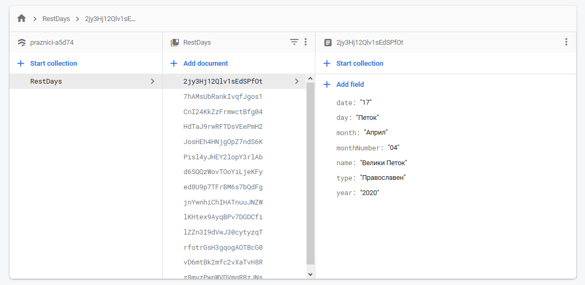
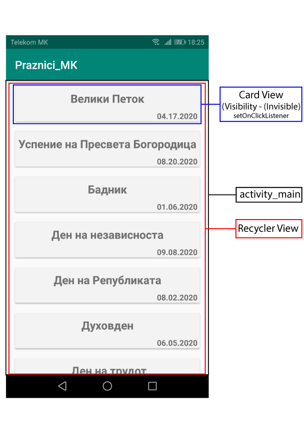
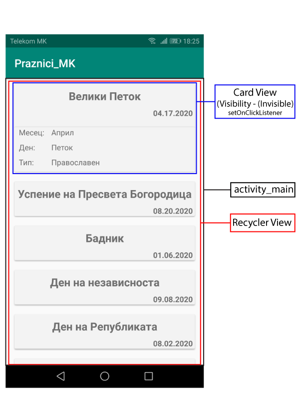

# Android_Praznici-MK
Show (Read) Holidays in RecyclerView from Firebase

## Description

  ### 1. Usaged
   - Card View
   - Recycler View
   - Visibility (Invisible / Visible)
   - Firebase (Database - Cloud Firestore)

  ### 2. Add dependency 
   - build.gradle.(Module: app)
    
    dependencies {
        
        // Recycler View
        implementation 'androidx.recyclerview:recyclerview:1.0.0'

        // Card View
        implementation 'androidx.cardview:cardview:1.0.0'

        // Firebase
        implementation 'com.google.firebase:firebase-analytics:17.2.1'

        // Firebase - Cloud Firestore
        implementation 'com.google.firebase:firebase-firestore:21.3.0'
    }

    // Firebase
    apply plugin: 'com.google.gms.google-services'

   - build.gradle.(Project: Praznici_MK)

    dependencies {
        classpath 'com.android.tools.build:gradle:3.5.2'

        // Firebase
        classpath 'com.google.gms:google-services:4.3.3'
        
    }
     
      
  ### 3. Create:                          

   **Package / Class:**
   - **adapter (Package)**
      - PrazniciAdapter.class
   - **model (Package)**
      - PrazniciModel.class
      
   - MainActivity.class   
   
  **layout:**
   - activity_main.xml
   - item_praznici.xml   
 
 ### 4.Firebase (Database - Cloud Firestore) / Screenshot
  

  ### 5.Concept / Screenshot
      

  ### 6.Demo
  

  ## Author: Nikola Petkovik
   ### contact:
   - Gmail: nikolapetkovik86@gmail.com
   
